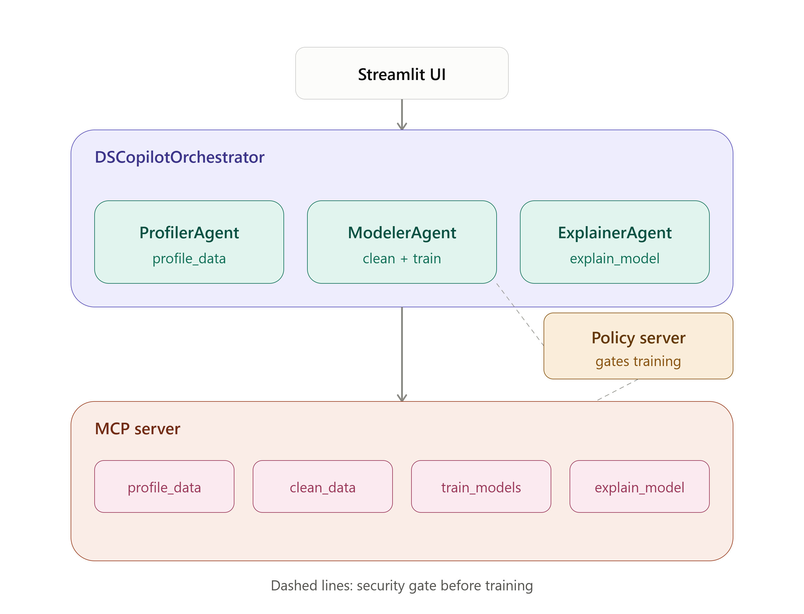

# Lucid AI Agent

## Problem
Any business with customer data wants to know who is about to leave and why. Doing that properly, profiling, cleaning, modeling, explaining, takes a data scientist hours per dataset. Most teams skip it or do it shallow.

## Solution
Give it a CSV and a target column. It profiles the data, cleans it only if profiling shows a problem, trains a baseline and a random forest, keeps the better one, and explains the predictions with SHAP. Whether cleaning runs is decided from what the profiling actually shows, not hardcoded.

## Architecture

- Orchestrator (`DSCopilotOrchestrator`, ADK `LlmAgent`): delegates to three sub-agents in order, deciding after each result whether to continue as planned
- Sub-agents: `ProfilerAgent`, `ModelerAgent`, `ExplainerAgent`, one per pipeline stage
- MCP server (`mcp_server/data_tools_server.py`): serves `profile_data`, `clean_data`, `train_models`, `explain_model` as tools
- Policy server (`security/policy_server.py`): blocks `train_models` under 50 rows
- Fallback pipeline (`agents/orchestrator_fallback.py`): same four steps, no ADK, used when the framework or API is down

## Course concepts demonstrated
- Multi-agent system (Google ADK): `agents/agent.py`
- MCP Server: `mcp_server/data_tools_server.py`
- Security: `security/policy_server.py`
- Deployability: not deployed, not required for judging; runs locally, see Setup

## Setup
pip install -r requirements.txt

- Set GOOGLE_API_KEY as an environment variable before running
- MCP server standalone: python mcp_server/data_tools_server.py
- App: python -m streamlit run app/streamlit_app.py

## Usage
Upload a CSV, type the target column, click run. The app tries ADK first and falls back to the direct pipeline if the API's unavailable, it tells you which one ran.

## Known limitations
- Gemini free tier: 20 requests/day. Testing burns through this fast and the ADK path falls back silently, watch for the banner.
- The orchestrator's step order is LLM-decided, not fully deterministic. It stopped early a few times during testing until the instruction explicitly required all three steps.
- ADK changed its API at 2.0, StdioServerParameters is deprecated in favour of StdioConnectionParams. This code matches the current docs as of submission.

## Demo dataset
Telco Customer Churn (kaggle.com/datasets/blastchar/telco-customer-churn). Chosen because churn has an obvious dollar cost to a business, fits Agents for Business directly.
